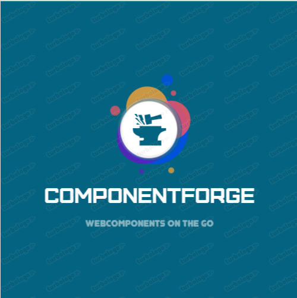

# Welcome to ComponentForge!

Hi!  ComponentForge is typescript based web component framework which will allow react developers to create quick fast web component 
the idea as how reacts component class + lit-html + decorators had a baby and that's ComponentForge.

# Basic Component

 

    import { html, TemplateResult } from  "lit-html";
    
    import { Component, Tag } from  "./../base/Component";
    
      
    
    @Tag("cf-button")
    
    class  CfButton  extends  Component {
    
    async  slotChnaged(event: any): Promise<void> {
	    console.log(event);
    }
    
    async  ComponentWillUnmount(): Promise<void> {
       console.log('component will unmount')
    }
    
    async  ComponentDidMount(): Promise<void> {
	    console.log('component did mount')
    }
    
    async  ComponentDidReceiedProps(propName:string , oldValue:any , newvalue:any): Promise<void> {
	    if(propName === "count"){
		    this.setState({count :  newvalue});
		    this.SetCount()
	    }
    }
    
    Style(): TemplateResult {
	    return  html``;
    }
    
    Template(): TemplateResult {
    
    return  html`<input  type="button"  class="${this.props["class"]}"  @click=${this.button_Click}
    
    id="${this.props.id}"  ?disabled="${this.state.count > 0}"  value="${this.props.value}  ${this.state.count}"  />`
    
    }
    
      
    
    //#region Events
    
    button_Click = (e:any) =>{
    this.fireEvent("onClick" , e )
    
    }
    
      
    
    //#endregion
    
    constructor() {
    
    super();
    
    this.state = {
    
	    count :parseInt( this.props.count),
    
    }
    
    // this.button_Click.bind(this)
    
	    this.SetCount()
    
    }
    
      
    
    SetCount() {
    
    const  inter = setInterval(() => {
    
    console.log(this.state.count , "setCount")
    
    if(this.state.count > 0){
    
    this.setState({count :  this.state.count - 1})
    
    }else{
    
    clearInterval(inter)
    
    }
    
    }, 1000)
    
    }
    
    }
    
      
    
    export  default  PhButton

## Few Components

 - Picture Taker Component (Take Selfies) 
 - Dynamic Table (Bind AnyObject) 
 - TodoList  
 - Image Gallery

## Need help

Need real help in building components may be integrating StoryBook give feedback

## Todos
  - Remove Diff
  - Remove Axios add fetch

## Roadmap

 1. Integrate Story Book  
 2. Release Demo Website 
 3. Have more components
